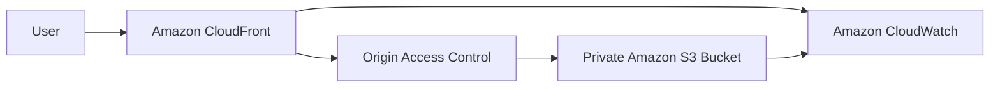

# Personal Website

A lightweight personal website hosted on AWS using Amazon S3 and Amazon CloudFront.

The project was built as a hands-on implementation of a static website architecture with Infrastructure as Code, security controls, monitoring, validation, and automated reporting.

## Architecture

The implemented architecture is:



### Main AWS Services

- **Amazon S3** — stores the static website files.
- **Amazon CloudFront** — provides global content delivery and HTTPS access.
- **CloudFront Origin Access Control (OAC)** — allows CloudFront to securely access the private S3 bucket.
- **Amazon CloudWatch** — provides monitoring dashboards and alarms.

## Requirements

### Functional Requirements

- Create and update personal CV content.
- Support static assets such as CSS, JavaScript, and images.
- Make the website accessible through the internet.
- Provide website monitoring and metrics.

### Non-Functional Requirements

- Low latency.
- High availability.
- Easy maintenance.
- Low operating cost.

## Project Structure

```text
01-personal-website/
├── application/
│   ├── index.html
│   ├── css/
│   │   └── style.css
│   └── js/
│       └── script.js
│
├── docs/
│   ├── requirements.md
│   └── architecture.md
│
├── reports/
│   └── monitoring-report.md
│
├── scripts/
│   ├── cleanup.sh
│   ├── generate-monitoring-report.sh
│   ├── setup-terraform.sh
│   └── validate-infrastructure.sh
│
├── terraform/
│   ├── README.md
│   ├── backend.tf
│   ├── versions.tf
│   ├── variables.tf
│   ├── main.tf
│   ├── s3.tf
│   ├── cloudfront.tf
│   ├── cloudwatch.tf
│   └── outputs.tf
│
└── README.md
```

## Infrastructure

The infrastructure is managed using Terraform.

### Amazon S3

The website bucket is configured as a private bucket with:

- Public access blocked.
- Bucket owner enforced object ownership.
- Versioning enabled.
- Server-side encryption using AES256.
- Bucket policy allowing read access only to the CloudFront service principal through the configured distribution.

### Amazon CloudFront

CloudFront is configured with:

- S3 origin.
- Origin Access Control using SigV4.
- HTTPS redirect for viewers.
- TLS 1.2 or later.
- IPv6 enabled.
- `index.html` as the default root object.
- Compression enabled.

Direct public access to the S3 bucket is not used.

### Amazon CloudWatch

The project includes:

- CloudFront requests dashboard.
- CloudFront 4xx error-rate dashboard metric.
- CloudFront 5xx error-rate dashboard metric.
- 4xx error alarm.
- 5xx error alarm.

## Application

The website is a static HTML, CSS, and JavaScript application.

It contains sections for:

- About
- Education
- Experience
- Skills
- Projects
- Contact

The application does not require a backend or external runtime dependencies.

## Deployment

The website files are uploaded to the private S3 bucket using the AWS CLI.

The bucket name can be retrieved from Terraform:

```bash
terraform output -raw website_bucket_name
```

The application can then be synchronized with:

```bash
aws s3 sync ../application "s3://$(terraform output -raw website_bucket_name)" --delete
```

Users access the website through the CloudFront distribution rather than directly through S3.

## Terraform Workflow

The project uses a helper script to prepare the remote Terraform state backend and initialize Terraform:

```bash
bash scripts/setup-terraform.sh
```

Then:

```bash
cd terraform

terraform validate
terraform plan -out=personal-website.tfplan
terraform apply personal-website.tfplan
```

Important infrastructure outputs can be viewed with:

```bash
terraform output
```

## Validation

The infrastructure includes a validation script:

```bash
bash scripts/validate-infrastructure.sh
```

The script validates important infrastructure and security settings, including:

- S3 public access blocking.
- S3 encryption.
- S3 versioning.
- CloudFront configuration.
- CloudFront OAC.
- HTTPS configuration.
- TLS version.
- CloudWatch dashboard.
- CloudWatch alarms.

## Monitoring Report

A simple Bash script reads CloudWatch metrics and generates a Markdown monitoring report:

```bash
bash scripts/generate-monitoring-report.sh
```

The generated report is stored at:

```text
reports/monitoring-report.md
```

The report includes:

- Monitoring period.
- CloudFront request count.
- 4xx error rate.
- 5xx error rate.
- CloudWatch alarm states.
- A short monitoring summary.

## Cleanup

The project includes a cleanup script:

```bash
bash scripts/cleanup.sh
```

The script removes the website objects and versions, destroys the Terraform-managed infrastructure, and removes the Terraform state backend.

This prevents unused AWS resources from continuing to incur costs.

## Security

The implemented security controls include:

- Private S3 bucket.
- S3 Public Access Block.
- Bucket Owner Enforced object ownership.
- Server-side encryption.
- CloudFront Origin Access Control.
- Restricted S3 bucket policy.
- HTTPS-only viewer access.
- TLS 1.2 or later.

## Future Work

The following improvements were considered but are not part of the current implementation:

- Amazon Route 53 for a custom domain.
- AWS Certificate Manager for a custom SSL/TLS certificate.
- AWS WAF.
- AWS Shield Advanced.
- CloudFront access logging.

## Lessons Learned

This project provided practical experience with:

- Designing a simple AWS static website architecture.
- Using S3 as private origin storage.
- Securing S3 access through CloudFront OAC.
- Managing AWS infrastructure with Terraform.
- Configuring CloudFront and HTTPS.
- Monitoring CloudFront through CloudWatch.
- Validating infrastructure configuration with shell scripts.
- Generating simple operational reports from CloudWatch metrics.
- Managing infrastructure cleanup and remote Terraform state.
