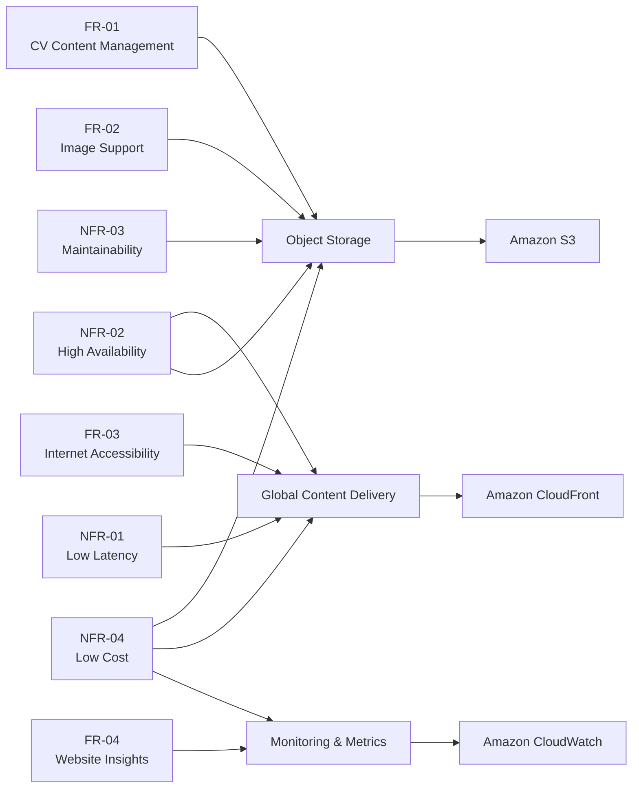
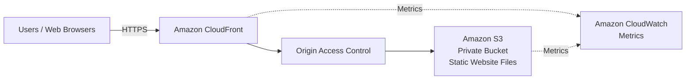
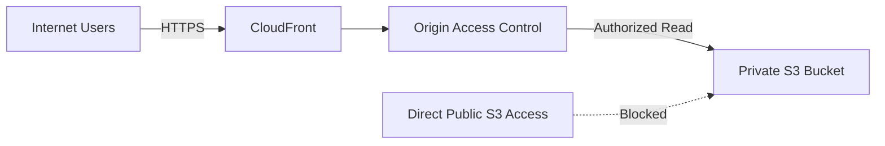

# Personal Website — Architecture

## 1. Architecture Overview

The Personal Website is designed as a static website architecture using managed AWS services.

The initial implementation consists of:

- Amazon S3 for static website content and assets
- Amazon CloudFront for global content delivery
- Amazon CloudWatch for monitoring and metrics

The architecture intentionally avoids continuously running application servers because the website does not require server-side application processing.

---

# 2. From Requirements to Architecture

The architecture is derived from the project requirements through the following process:

```text
Requirements
     ↓
Required Capabilities
     ↓
AWS Services
     ↓
Architecture
     ↓
Implementation
     ↓
Evaluation
```

The objective is to ensure that every major architecture component can be traced back to an actual project requirement.

---

# 3. Requirements → Capabilities → Services



---

## 4. Requirements Mapping

| Requirement | Required Capability | AWS Service | Architecture Role |
|---|---|---|---|
| FR-01 CV Content Management | Object storage | Amazon S3 | Stores website files |
| FR-02 Image Support | Static object storage | Amazon S3 | Stores images and other assets |
| FR-03 Internet Accessibility | Global content delivery | Amazon CloudFront | Public entry point for website delivery |
| FR-04 Website Insights | Monitoring and metrics | Amazon CloudWatch | Provides website and delivery metrics |
| NFR-01 Low Latency | Edge caching | Amazon CloudFront | Serves cached content from edge locations |
| NFR-02 High Availability | Managed storage + distributed delivery | S3 + CloudFront | Removes dependency on a single web server |
| NFR-03 Maintainability | Managed infrastructure | S3 + CloudFront | Reduces server administration |
| NFR-04 Low Cost | Usage-based managed services | S3 + CloudFront + CloudWatch | Avoids continuously running compute |

---

# 5. Actual Architecture

The implemented architecture is:



### Request Flow

1. A user accesses the website through a web browser.
2. The request reaches Amazon CloudFront.
3. CloudFront checks whether the requested content is available in its cache.
4. If the content is not available in the cache, CloudFront retrieves it from the S3 origin.
5. CloudFront uses Origin Access Control to access the private S3 bucket.
6. The requested content is returned to the user.
7. Relevant service metrics are available through Amazon CloudWatch.

---

# 6. Amazon S3

## Role

Amazon S3 is the origin storage layer for the website.

It stores:

- HTML files
- CSS files
- JavaScript files
- Images
- Other static website assets

## Why S3?

The functional requirements require persistent storage for website content and images.

S3 provides:

- Object storage
- High durability
- Managed infrastructure
- Versioning support
- Scalable storage
- Usage-based pricing

Most importantly, the website is static, so a full web server is unnecessary for the current requirements.

## Security Design

The S3 bucket will not be publicly accessible.

The implementation will use:

- S3 Block Public Access
- CloudFront Origin Access Control
- Bucket policy allowing the CloudFront distribution to retrieve objects

The intended request path is:

```text
User
  ↓
CloudFront
  ↓
Origin Access Control
  ↓
Private S3 Bucket
```

This prevents users from bypassing CloudFront and directly accessing the S3 origin.

---

# 7. Amazon CloudFront

## Role

Amazon CloudFront is the content-delivery layer and public entry point of the architecture.

## Why CloudFront?

The requirements include:

- Internet accessibility
- Low latency
- High availability

These requirements lead to the need for global content delivery and edge caching.

CloudFront provides:

- Global edge locations
- Content caching
- HTTPS delivery
- Integration with S3
- High availability
- Reduced origin requests when content is cached

## Why Not Direct S3 Website Hosting?

S3 can provide static website hosting, but the architecture uses CloudFront instead of exposing the S3 website endpoint directly.

CloudFront provides the additional delivery layer required for:

- Global caching
- HTTPS delivery
- Better control over access to the S3 origin
- A single public entry point

The S3 bucket therefore remains private and CloudFront retrieves the content through OAC.

---

# 8. Amazon CloudWatch

## Role

Amazon CloudWatch provides the monitoring and metrics layer.

## Why CloudWatch?

FR-04 requires the ability to generate insights from website data.

This requires monitoring information such as:

- Number of requests
- HTTP error rates
- Traffic and data transfer
- Other relevant CloudFront and S3 metrics

CloudWatch provides the monitoring foundation for evaluating website behavior.

The initial implementation focuses on metrics rather than introducing a separate analytics platform.

---

# 9. Security Architecture

Security is incorporated into the implemented architecture rather than being treated as a separate future enhancement.

The main security design is:



The S3 bucket is protected using Block Public Access.

CloudFront is granted controlled access to the bucket through Origin Access Control.

This creates a clear separation between:

- Public delivery layer: CloudFront
- Private origin: S3

---

# 10. Architecture Evaluation

The architecture will be evaluated against the original requirements throughout implementation.

## Initial Evaluation

| Requirement | Architecture Component | Status | Evaluation |
|---|---|---|---|
| FR-01 Content Management | Amazon S3 | Planned | S3 provides object storage for website content |
| FR-02 Image Support | Amazon S3 | Planned | S3 supports image and other static objects |
| FR-03 Internet Accessibility | CloudFront | Planned | CloudFront provides internet-facing delivery |
| FR-04 Website Insights | CloudWatch | Planned | CloudWatch provides monitoring metrics |
| NFR-01 Low Latency | CloudFront | Planned | Edge caching addresses latency |
| NFR-02 High Availability | S3 + CloudFront | Planned | Managed and distributed services reduce single-server dependency |
| NFR-03 Maintainability | S3 + CloudFront | Planned | No continuously managed web server |
| NFR-04 Low Cost | S3 + CloudFront + CloudWatch | Planned | Usage-based managed services avoid dedicated compute |

The status will be updated during implementation.

A requirement will be considered **Implemented** only after the corresponding AWS component has been provisioned, configured, and validated.

---

# 11. Architecture Validation

The architecture will be validated through implementation and testing.

Validation will include:

### S3

- Bucket is successfully created
- Public access is blocked
- Website objects can be stored
- CloudFront can retrieve objects
- Direct public access to the bucket is not allowed

### CloudFront

- Distribution is successfully deployed
- CloudFront can retrieve the S3 content
- The default root object works
- Website is accessible through the CloudFront domain
- HTTPS access works
- Cached content can be served successfully

### CloudWatch

- Relevant metrics are available
- Website requests generate observable metrics
- Error-related metrics can be inspected

### End-to-End

```text
Browser
   ↓
CloudFront
   ↓
OAC
   ↓
Private S3
   ↓
Static Website Content
```

The complete request path must work before the architecture is considered implemented.

---

# 12. Architecture Trade-offs

## Benefits

- No continuously running web servers
- Simple architecture
- Low operational overhead
- Global content delivery
- Private S3 origin
- Easy static content management
- Built-in AWS monitoring capabilities
- Suitable for low-cost static website hosting

## Trade-offs

- The architecture is designed for static content
- Dynamic server-side functionality would require additional services
- CloudFront caching introduces cache invalidation considerations
- CloudWatch monitoring can generate additional costs depending on usage
- A custom domain and certificate are not included in the current implementation

---

# 13. Future Work

The following components are intentionally **not part of the current implementation**.

They are documented as possible future enhancements only.

## Route 53

A custom domain can be added in the future using Amazon Route 53.

## AWS Certificate Manager

ACM can be introduced when a custom domain is added and a dedicated certificate is required.

## AWS WAF

AWS WAF can be added in front of CloudFront for additional web application protection and traffic filtering.

## AWS Shield Advanced

Shield Advanced can be evaluated if the website's protection requirements justify the additional cost and operational considerations.

## CloudFront Access Logging

CloudFront access logs can be enabled and stored for deeper request-level analysis.

---

# 14. Architecture Evolution

The current implementation intentionally starts with the minimum architecture required to satisfy the project requirements.

### Current Architecture

```text
Users
  ↓
CloudFront
  ↓
Private S3
  ↓
Static Website
```

with monitoring through:

```text
CloudFront ──┐
             ├──> CloudWatch
S3 ──────────┘
```

### Future Enhanced Architecture

The future architecture may evolve toward:

```text
Users
  ↓
Route 53
  ↓
WAF
  ↓
CloudFront
  ↓
Private S3
```

with:

```text
ACM → Custom HTTPS Certificate
CloudWatch → Monitoring
CloudFront Logs → Logging / Analysis
```

These enhancements are intentionally excluded from the current implementation and will not be treated as implemented features.