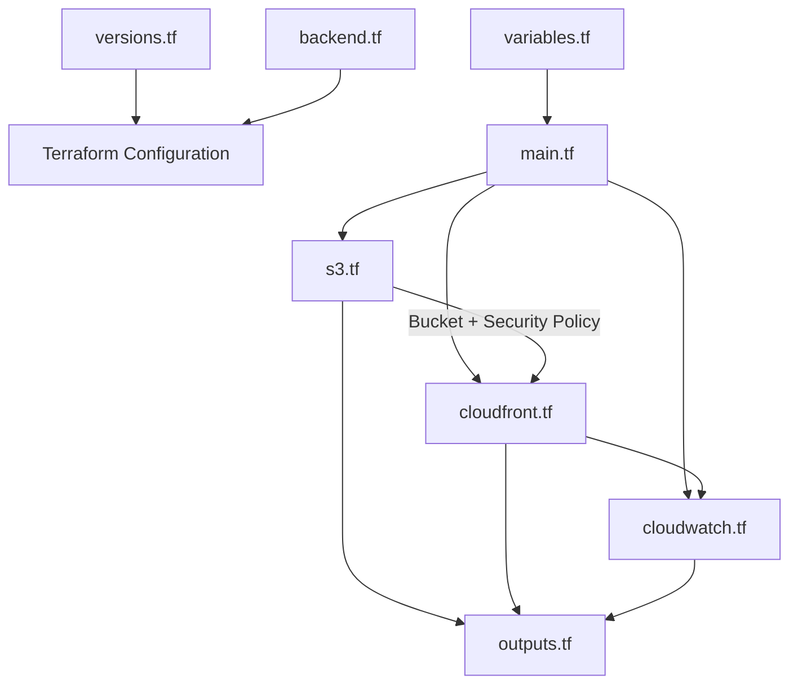
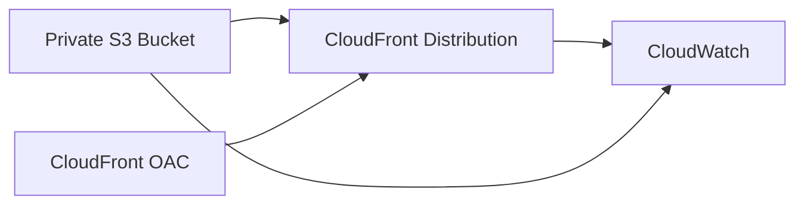
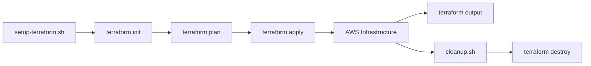

# Terraform Infrastructure

This directory contains the Terraform configuration for the Personal Website project.

The infrastructure is intentionally kept simple because the project uses a small number of closely related AWS services.

## Directory Structure

```text
terraform/
├── README.md
├── backend.tf
├── versions.tf
├── variables.tf
├── main.tf
├── s3.tf
├── cloudfront.tf
├── cloudwatch.tf
└── outputs.tf
```

## File Responsibilities

| File            | Responsibility                                                                                               |
| --------------- | ------------------------------------------------------------------------------------------------------------ |
| `versions.tf`   | Defines the required Terraform version and AWS provider.                                                     |
| `backend.tf`    | Configures the S3 remote state backend and state locking.                                                    |
| `variables.tf`  | Defines configurable Terraform input variables.                                                              |
| `main.tf`       | Defines shared locals and common resource tags.                                                              |
| `s3.tf`         | Creates the private website bucket, security controls, versioning, encryption, and CloudFront access policy. |
| `cloudfront.tf` | Creates the CloudFront Origin Access Control and distribution.                                               |
| `cloudwatch.tf` | Creates the CloudWatch dashboard and monitoring alarms.                                                      |
| `outputs.tf`    | Exposes important infrastructure values such as the S3 bucket and CloudFront distribution.                   |

## Configuration Relationship

The Terraform files work together as a single configuration rather than as independent modules.



## Resource Dependency Flow

The main infrastructure dependency is:



The S3 bucket policy also connects the private bucket to the CloudFront distribution by allowing the CloudFront service principal to read objects only through the configured distribution.

## Terraform Workflow

The project follows the standard Terraform workflow:



### 1. Initialize

The project uses a setup script to prepare the Terraform state backend and initialize Terraform:

```bash
../scripts/setup-terraform.sh
```

The script:

- Checks that Terraform and AWS CLI are installed.
- Verifies AWS authentication.
- Creates and secures the remote S3 state bucket if needed.
- Enables versioning and server-side encryption on the state bucket.
- Initializes Terraform with the remote backend.
- Formats and validates the Terraform configuration.

### 2. Validate

```bash
terraform validate
```

Checks whether the Terraform configuration is syntactically valid and internally consistent.

### 3. Plan

```bash
terraform plan -out=personal-website.tfplan
```

Shows the infrastructure changes Terraform intends to make.

### 4. Apply

```bash
terraform apply "personal-website.tfplan"
```

Creates or updates the AWS infrastructure.

### 5. Outputs

```bash
terraform output
```

Displays important values produced by the infrastructure.

### 6. Destroy

For project cleanup, use the cleanup script instead of running `terraform destroy` directly:

```bash
../scripts/cleanup.sh
```

The cleanup script:

- Requires explicit confirmation before deletion.
- Removes objects and object versions from the website bucket.
- Runs `terraform destroy`.
- Removes the Terraform state backend and its stored objects.

This provides a complete cleanup flow for both the deployed infrastructure and the Terraform state backend.

## State Management

Terraform state is stored remotely in an Amazon S3 bucket.

The backend configuration is intentionally kept separate from the normal Terraform variables because Terraform backend configuration is initialized before input variables are evaluated.

The setup script is responsible for preparing the backend bucket before Terraform initialization.

## Design Notes

### No Terraform Modules

This project does not use custom Terraform modules.

The infrastructure is small and the resources are closely related, so keeping the configuration in a few logical files makes the dependency flow easier to understand and maintain.

### S3 and CloudFront Relationship

The website content is stored in a private S3 bucket.

CloudFront accesses the bucket through Origin Access Control (OAC), while direct public access to the S3 bucket is blocked.

### Monitoring

CloudWatch provides:

- A dashboard for CloudFront metrics.
- A 4xx error-rate alarm.
- A 5xx error-rate alarm.

The alarms are currently used for monitoring and do not include notification actions.

## Validation

The project includes an infrastructure validation script:

```bash
../scripts/validate-infrastructure.sh
```

The script checks the main security, configuration, and monitoring requirements of the deployed infrastructure.