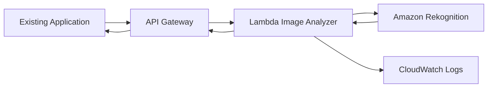
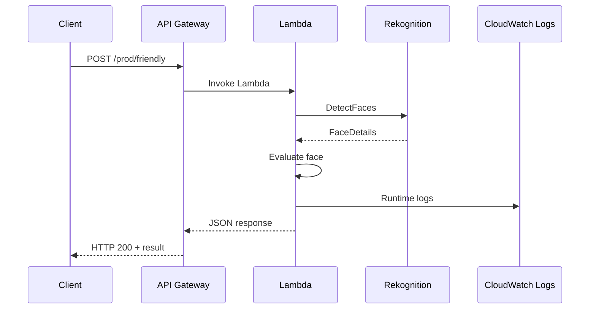
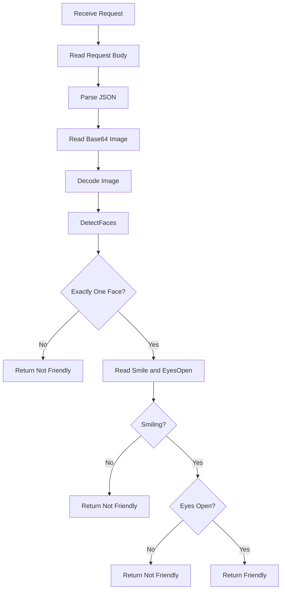
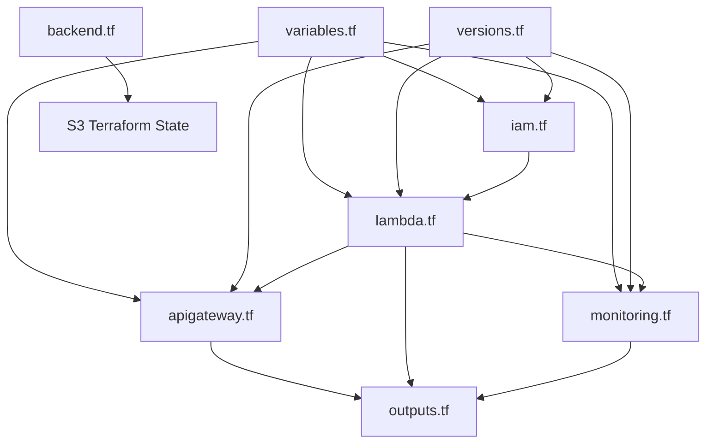

# Image Analyzer

A serverless AWS image-analysis API that determines whether a profile photo is suitable based on facial characteristics.

This project was implemented as a hands-on AWS learning project while studying the **AWS Cloud Projects** course by Packt on Coursera.

The implementation uses:

- Amazon API Gateway
- AWS Lambda
- Amazon Rekognition
- Amazon CloudWatch
- Terraform

The application does not persist uploaded images.

---

## Project Overview

A marketing company receives customer information and photos and uses them to create social media profiles.

The company identified that some photos appeared unprofessional and wanted an automated way to check profile photos before they are used.

For this project, a photo is considered suitable when:

- exactly one face is detected
- the person is smiling
- the person's eyes are open

The system returns a structured result to the calling application.

---

## Architecture



### Request Flow



---

## Project Structure

```text
02-image-analyzer/
│
├── README.md
│
├── docs/
│   ├── requirements.md
│   └── architecture.md
│
├── terraform/
│   ├── README.md
│   ├── backend.tf
│   ├── versions.tf
│   ├── variables.tf
│   ├── iam.tf
│   ├── lambda.tf
│   ├── apigateway.tf
│   ├── monitoring.tf
│   └── outputs.tf
│
├── application/
│   ├── lambda/
│   │   └── handler.py
│   │
│   └── interact.py
│
├── scripts/
│   ├── setup-terraform.sh
│   ├── cleanup-terraform-backend.sh
│   └── run-tests.sh
│
├── test-data/
│   ├── smiling.jfif
│   ├── not-smiling.jfif
│   └── multiple-faces.jfif
│
└── reports/
    └── test-results.md
```

---

# Requirements

## Functional Requirements

The system must:

1. Determine whether a photo is suitable as a profile picture.
2. Integrate with other Python applications.
3. Accept image data through an API.
4. Support common image formats including PNG and JPEG.

## Non-Functional Requirements

The solution should:

- be highly available
- have low operational cost
- support up to approximately 20 requests per second

## Data Requirement

Uploaded images must not be persistently stored.

The image is:

```text
Client
  ↓
API Gateway
  ↓
Lambda memory
  ↓
Rekognition
```

No application S3 bucket, database, or other persistent image store is used.

---

# AWS Services

| Service | Responsibility |
|---|---|
| API Gateway | Exposes the HTTPS API |
| Lambda | Processes requests and evaluates the result |
| Rekognition | Detects faces and facial attributes |
| CloudWatch Logs | Stores Lambda execution logs |
| IAM | Controls Lambda permissions |
| S3 | Stores Terraform state only |

---

# API

## Endpoint

The deployed endpoint is available through the Terraform output:

```bash
terraform -chdir=terraform output -raw friendly_endpoint
```

Current API structure:

```text
POST /prod/friendly
```

## Request

The client sends JSON containing a Base64 encoded image:

```json
{
  "image": "<base64-image>"
}
```

## Successful Response

Example:

```json
{
  "friendly": true,
  "reason": "friendly",
  "face_count": 1,
  "smiling": true,
  "eyes_open": true
}
```

## Non-Friendly Response

Example:

```json
{
  "friendly": false,
  "reason": "not_smiling",
  "face_count": 1,
  "smiling": false,
  "eyes_open": true
}
```

For multiple faces:

```json
{
  "friendly": false,
  "reason": "exactly_one_face_required",
  "face_count": 2
}
```

---

# Application Logic



---

# Security

The Lambda execution role follows a least-privilege approach.

The function requires:

```text
rekognition:DetectFaces
```

and CloudWatch Logs permissions.

The Lambda role is not automatically attached to every Lambda function.

Only the Lambda configured with:

```text
image-analyzer-lambda-execution-role
```

uses this role.

## Image Privacy

Images are not stored by the application.

The image is decoded in Lambda memory and sent directly to Rekognition.

The application does not intentionally log:

- image bytes
- Base64 image content
- customer information

## API Authentication

The current MVP API uses:

```text
authorization = NONE
```

This keeps the learning project simple and allows integration testing.

For a production implementation, authentication and authorization should be added.

Possible future approaches include:

- Amazon Cognito
- IAM authorization
- API Gateway authorizers
- WAF
- throttling controls

---

# Infrastructure as Code

The complete infrastructure is defined using Terraform.



See:

```text
terraform/README.md
```

for the detailed Terraform file relationships and workflow.

---

# Setup

## Prerequisites

Install/configure:

```text
AWS CLI
Terraform
Python 3
pip
```

Verify:

```bash
aws --version
```

```bash
terraform version
```

```bash
python3 --version
```

Verify AWS authentication:

```bash
aws sts get-caller-identity
```

---

# Terraform Setup

From the project directory:

```bash
cd 02-image-analyzer
```

Run:

```bash
bash scripts/setup-terraform.sh
```

The script creates/configures the Terraform S3 backend and initializes Terraform.

---

# Manual Terraform Initialization

The equivalent manual command is:

```bash
terraform -chdir=terraform init \
  -backend-config="bucket=aliaa-image-analyzer-tfstate" \
  -backend-config="key=projects/image-analyzer/terraform.tfstate" \
  -backend-config="region=us-east-1"
```

Format:

```bash
terraform -chdir=terraform fmt -recursive
```

Validate:

```bash
terraform -chdir=terraform validate
```

---

# Deploy

Create a plan:

```bash
terraform -chdir=terraform plan \
  -out=image-analyzer.tfplan
```

Apply the saved plan:

```bash
terraform -chdir=terraform apply \
  "image-analyzer.tfplan"
```

Check outputs:

```bash
terraform -chdir=terraform output
```

Get only the endpoint:

```bash
terraform -chdir=terraform output -raw friendly_endpoint
```

---

# Lambda Verification

Check the deployed function:

```bash
aws lambda get-function-configuration \
  --function-name image-analyzer-function \
  --region us-east-1
```

The deployed configuration includes:

```text
Runtime: python3.13
Handler: handler.lambda_handler
Memory: 256 MB
Timeout: 30 seconds
Architecture: x86_64
```

---

# Testing

The project contains three test images:

```text
test-data/smiling.jfif
test-data/not-smiling.jfif
test-data/multiple-faces.jfif
```

The Python client obtains the API endpoint dynamically from Terraform.

## Install Python Dependency

```bash
python3 -m pip install requests
```

## Test a Friendly Image

```bash
python3 application/interact.py \
  test-data/smiling.jfif
```

Expected result:

```text
HTTP status: 200

{
  "friendly": true,
  "reason": "friendly",
  "face_count": 1,
  "smiling": true,
  "eyes_open": true
}
```

## Test a Non-Smiling Image

```bash
python3 application/interact.py \
  test-data/not-smiling.jfif
```

Expected result:

```text
HTTP status: 200

{
  "friendly": false,
  "reason": "not_smiling",
  "face_count": 1,
  "smiling": false,
  "eyes_open": true
}
```

## Test Multiple Faces

```bash
python3 application/interact.py \
  test-data/multiple-faces.jfif
```

Expected result:

```text
HTTP status: 200

{
  "friendly": false,
  "reason": "exactly_one_face_required",
  "face_count": 2
}
```

---

# Automated Test Runner

Run:

```bash
bash scripts/run-tests.sh
```

The script:

1. Finds test images.
2. Sends each image to the API.
3. Checks the HTTP response.
4. Prints the results.
5. Generates:

```text
reports/test-results.md
```

---

# CloudWatch Monitoring

Lambda automatically sends execution information to:

```text
/aws/lambda/image-analyzer-function
```

The project manages this Log Group with Terraform.

Retention:

```text
14 days
```

## View Logs

```bash
aws logs tail \
  "/aws/lambda/image-analyzer-function" \
  --since 30m \
  --region us-east-1
```

For recent logs:

```bash
aws logs tail \
  "/aws/lambda/image-analyzer-function" \
  --since 5m \
  --region us-east-1
```

## Example Runtime Information

CloudWatch provides information such as:

```text
Duration
Billed Duration
Memory Size
Max Memory Used
Init Duration
```

For example:

```text
Duration: 361.89 ms
Billed Duration: 843 ms
Memory Size: 256 MB
Max Memory Used: 94 MB
Init Duration: 480.53 ms
```

This allows basic monitoring of:

- execution duration
- memory utilization
- cold starts
- Lambda execution activity

---

# CloudWatch Log Group Import

Lambda can automatically create its Log Group during the first invocation.

If Terraform reports:

```text
ResourceAlreadyExistsException
```

for:

```text
/aws/lambda/image-analyzer-function
```

import the existing resource:

```bash
terraform -chdir=terraform import \
  aws_cloudwatch_log_group.lambda \
  "/aws/lambda/image-analyzer-function"
```

Then:

```bash
terraform -chdir=terraform plan
```

Terraform can then manage the existing Log Group.

In this project, the resulting configuration change was:

```text
retention_in_days = 0 -> 14
```

---

# Cleanup

Destroy all Terraform-managed infrastructure:

```bash
terraform -chdir=terraform destroy
```

After destroying the infrastructure, remove the Terraform backend if the project is no longer needed:

```bash
bash scripts/cleanup-terraform-backend.sh
```

The backend cleanup script requires:

```text
DELETE
```

as explicit confirmation.

The backend cleanup removes all object versions/delete markers before deleting the S3 bucket.

---

# Complete Command Reference

## Project Setup

```bash
cd 02-image-analyzer
```

```bash
aws --version
```

```bash
terraform version
```

```bash
python3 --version
```

```bash
aws sts get-caller-identity
```

## Terraform

```bash
bash scripts/setup-terraform.sh
```

```bash
terraform -chdir=terraform init \
  -backend-config="bucket=aliaa-image-analyzer-tfstate" \
  -backend-config="key=projects/image-analyzer/terraform.tfstate" \
  -backend-config="region=us-east-1"
```

```bash
terraform -chdir=terraform fmt -recursive
```

```bash
terraform -chdir=terraform validate
```

```bash
terraform -chdir=terraform plan
```

```bash
terraform -chdir=terraform plan \
  -out=image-analyzer.tfplan
```

```bash
terraform -chdir=terraform apply \
  "image-analyzer.tfplan"
```

```bash
terraform -chdir=terraform output
```

```bash
terraform -chdir=terraform output \
  -raw friendly_endpoint
```

```bash
terraform -chdir=terraform destroy
```

## CloudWatch Import

```bash
terraform -chdir=terraform import \
  aws_cloudwatch_log_group.lambda \
  "/aws/lambda/image-analyzer-function"
```

```bash
terraform -chdir=terraform plan
```

## Lambda

```bash
aws lambda get-function-configuration \
  --function-name image-analyzer-function \
  --region us-east-1
```

## Testing

```bash
python3 -m pip install requests
```

```bash
python3 application/interact.py \
  test-data/smiling.jfif
```

```bash
python3 application/interact.py \
  test-data/not-smiling.jfif
```

```bash
python3 application/interact.py \
  test-data/multiple-faces.jfif
```

```bash
bash scripts/run-tests.sh
```

## CloudWatch Logs

```bash
aws logs tail \
  "/aws/lambda/image-analyzer-function" \
  --since 30m \
  --region us-east-1
```

```bash
aws logs tail \
  "/aws/lambda/image-analyzer-function" \
  --since 5m \
  --region us-east-1
```

## Backend Cleanup

```bash
bash scripts/cleanup-terraform-backend.sh
```

---

# Current Implementation

The current implementation provides:

```text
API Gateway
     ↓
Lambda
     ↓
Amazon Rekognition
     ↓
Structured JSON Response
```

Infrastructure:

```text
Terraform
     ↓
IAM
Lambda
API Gateway
CloudWatch Logs
S3 Terraform State
```

Testing:

```text
Python Client
     ↓
API Gateway
     ↓
Lambda
     ↓
Rekognition
```

Monitoring:

```text
Lambda
     ↓
CloudWatch Logs
```

---

# Design Decisions

## Why Lambda?

The workload is request-driven and does not require continuously running servers.

Lambda provides:

- automatic scaling
- no server management
- pay-per-use execution
- direct integration with API Gateway

## Why API Gateway?

The API layer allows existing applications to interact with the image analyzer without requiring AWS credentials.

It also provides a clean HTTPS API boundary between client applications and the Lambda function.

## Why Rekognition?

Rekognition provides the facial analysis capabilities required by the project without implementing the computer-vision model from scratch.

## Why No S3 Image Storage?

The requirement states that personal information should not be stored.

The image therefore remains transient:

```text
Request
  ↓
Lambda memory
  ↓
Rekognition
  ↓
Result
```

There is no persistent application image store.

---

# Limitations

The current implementation is intentionally an MVP.

Current limitations include:

- API authentication is not enabled.
- The API is publicly reachable through API Gateway.
- No WAF is configured.
- No custom domain is configured.
- No advanced API throttling configuration is included.
- Monitoring currently focuses on CloudWatch execution logs.
- The classification logic is based on Rekognition facial attributes rather than a custom ML model.

---

# Future Improvements

Possible improvements include:

```text
API Authentication
       ↓
Cognito / IAM / Authorizer
       ↓
WAF
       ↓
API Gateway
       ↓
Lambda
       ↓
Rekognition
```

Other possible improvements:

- API throttling
- CloudWatch alarms
- CloudWatch dashboard
- structured application logging
- custom metrics
- asynchronous processing
- image moderation
- custom ML classification
- SageMaker integration
- custom domain with ACM
- CI/CD deployment

---

# Learning Outcomes

This project provided practical experience with:

- Terraform
- Terraform remote state
- Terraform resource dependencies
- IAM roles and policies
- Lambda
- API Gateway
- Amazon Rekognition
- CloudWatch Logs
- serverless architecture
- Python API integration
- Base64 image processing
- Infrastructure testing
- AWS CLI
- least-privilege permissions
- infrastructure cleanup

---

# Project Status

The core Image Analyzer implementation is complete.

The deployed flow has been tested successfully with:

```text
Smiling image
    → friendly = true

Non-smiling image
    → friendly = false

Multiple faces
    → friendly = false
```

CloudWatch Lambda execution logs have also been verified.

---

**Learn → Build → Test → Monitor → Document → Improve**