# Image Analyzer Architecture

## 1. Architecture Overview

The Image Analyzer uses a serverless architecture to expose an image-analysis API to existing applications.

A consuming application submits an image encoded as Base64 through an HTTPS POST request.

The request is received by Amazon API Gateway and forwarded to an AWS Lambda function.

Lambda validates and decodes the image, then calls Amazon Rekognition `DetectFaces`.

Rekognition analyzes the image and returns facial attributes.

Lambda evaluates the response and returns a structured classification to the consuming application.

No persistent storage is used for submitted images.

---

## 2. High-Level Architecture

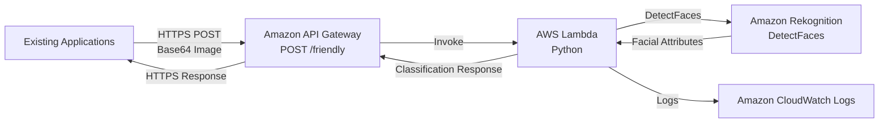

---

## 3. Request and Response Flow

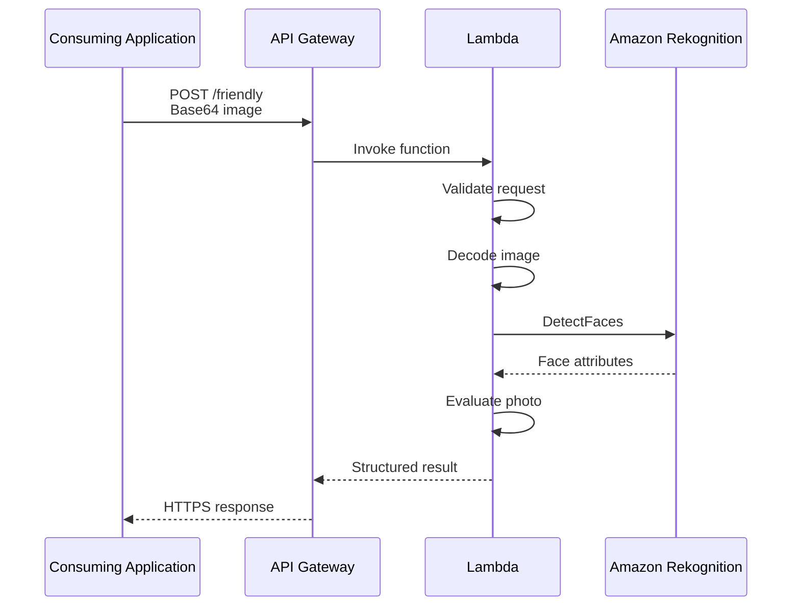

---

## 4. Application Decision Flow

The Lambda function applies the business rules after receiving the Rekognition response.

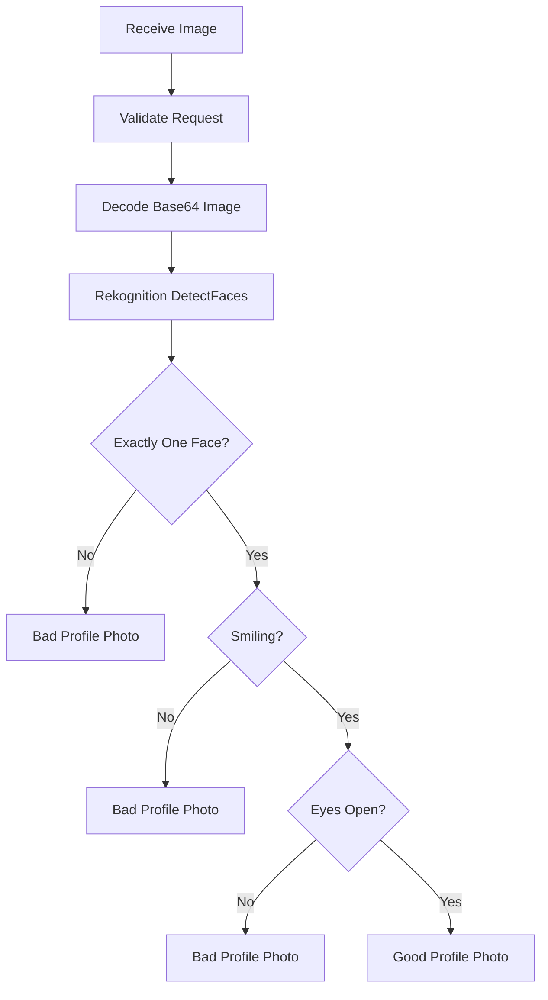

---

## 5. Requirements-to-Architecture Mapping

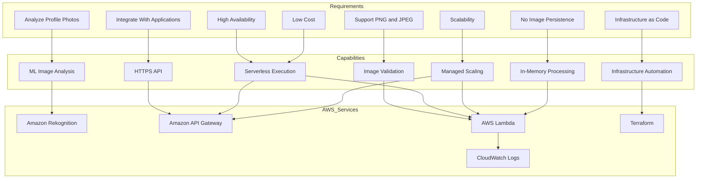

---

## 6. AWS Service Responsibilities

### Amazon API Gateway

API Gateway provides the public HTTPS interface for consuming applications.

Responsibilities:

- Expose the API endpoint.
- Receive POST requests.
- Route requests to Lambda.
- Return Lambda responses to clients.

Initial API:

```text
POST /friendly
```

---

### AWS Lambda

Lambda contains the application logic.

Responsibilities:

- Validate the incoming request.
- Decode Base64 image data.
- Call Rekognition.
- Evaluate facial attributes.
- Generate the final classification.
- Return a structured response.
- Produce application logs.

Lambda does not persist submitted images.

---

### Amazon Rekognition

Rekognition provides the managed ML capability.

The application uses:

```text
DetectFaces
```

The response is used to evaluate:

- Number of detected faces.
- Smile status.
- Eyes-open status.

Rekognition is used instead of developing and hosting a custom computer-vision model.

---

### Amazon CloudWatch

CloudWatch Logs receives Lambda execution logs.

This provides visibility into:

- Function execution.
- Errors.
- Debugging information.
- Operational behavior.

---

## 7. Security Architecture

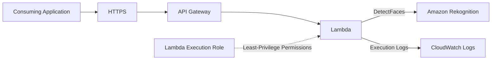

Security principles:

- Client communication uses HTTPS.
- Client applications do not receive AWS credentials.
- Lambda accesses Rekognition through its IAM execution role.
- The Lambda role uses least-privilege permissions.
- Images are not persisted.
- CloudWatch provides operational visibility.

---

## 8. Data Flow

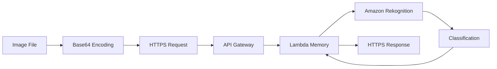

There is intentionally no S3, database, or other persistent storage component in the image data path.

---

## 9. Terraform Architecture

Terraform provisions the infrastructure required by the application.

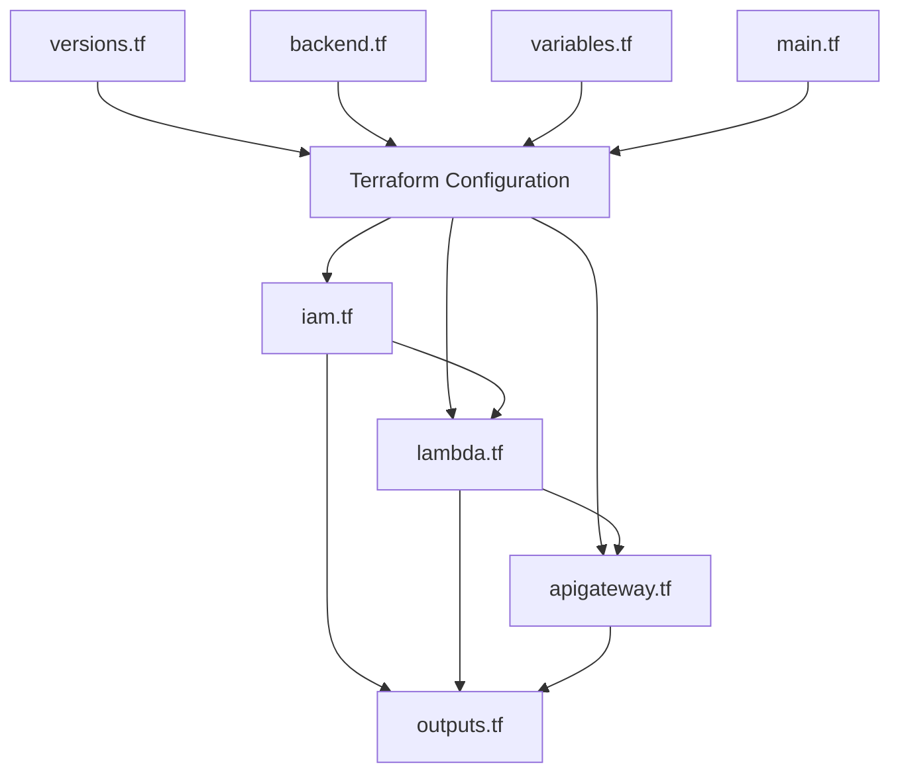

---

## 10. Infrastructure Dependency Flow

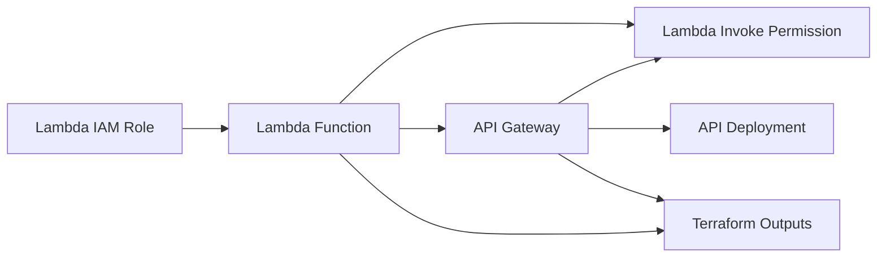

---

## 11. API Architecture

```mermaid
flowchart TD
    ROOT[API Gateway Root]
    FRIENDLY[/friendly]
    POST[POST Method]
    INTEGRATION[Lambda Integration]
    FUNCTION[Image Analyzer Lambda]
    RESPONSE[API Response]

    ROOT --> FRIENDLY
    FRIENDLY --> POST
    POST --> INTEGRATION
    INTEGRATION --> FUNCTION
    FUNCTION --> RESPONSE
    RESPONSE --> POST
```

The initial API uses a regional API Gateway endpoint.

---

## 12. Deployment Flow

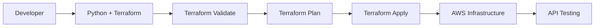

---

## 13. Testing Architecture

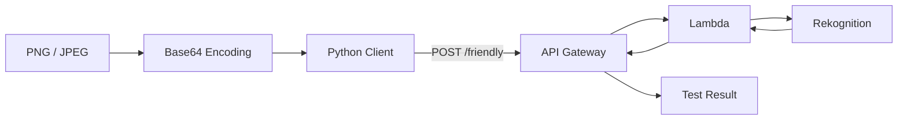

Testing will cover at least:

- Good profile photo.
- Photo without a face.
- Photo with multiple faces.
- Photo with closed eyes.
- Photo without a smile.
- Invalid request payload.
- Unsupported image format.

---

## 14. Architecture Evaluation

| Requirement | Architectural Decision | Result |
|---|---|---|
| ML classification | Amazon Rekognition | Satisfied |
| Application integration | API Gateway | Satisfied |
| Business logic | Lambda | Satisfied |
| PNG/JPEG support | Lambda + Rekognition | Satisfied |
| High availability | Managed AWS services | Satisfied |
| Low cost | Serverless pay-per-request | Satisfied |
| Scalability | API Gateway + Lambda + Rekognition | Satisfied |
| No image persistence | No storage layer | Satisfied |
| Python integration | HTTP API + Python client | Satisfied |
| Infrastructure as Code | Terraform | Satisfied |
| Least privilege | Dedicated Lambda IAM permissions | Satisfied |

---

## 15. Architecture Trade-offs

### Amazon Rekognition vs Custom ML Model

Amazon Rekognition was selected because:

- It provides a managed computer-vision capability.
- No training dataset is required.
- No model infrastructure needs to be managed.
- It supports facial attribute analysis.
- It scales with the application.

A custom ML model would provide greater customization but would introduce additional data, training, infrastructure, and operational requirements.

---

### API Gateway + Lambda vs Direct Rekognition Access

The client does not communicate directly with Rekognition because doing so would require distributing AWS credentials and would expose AWS service details to consuming applications.

API Gateway and Lambda provide an abstraction layer that:

- Hides AWS service credentials.
- Encapsulates business logic.
- Allows response customization.
- Provides a standard HTTPS interface.
- Creates a natural location for authentication and authorization enhancements.

---

## 16. Current Architecture vs Future Architecture

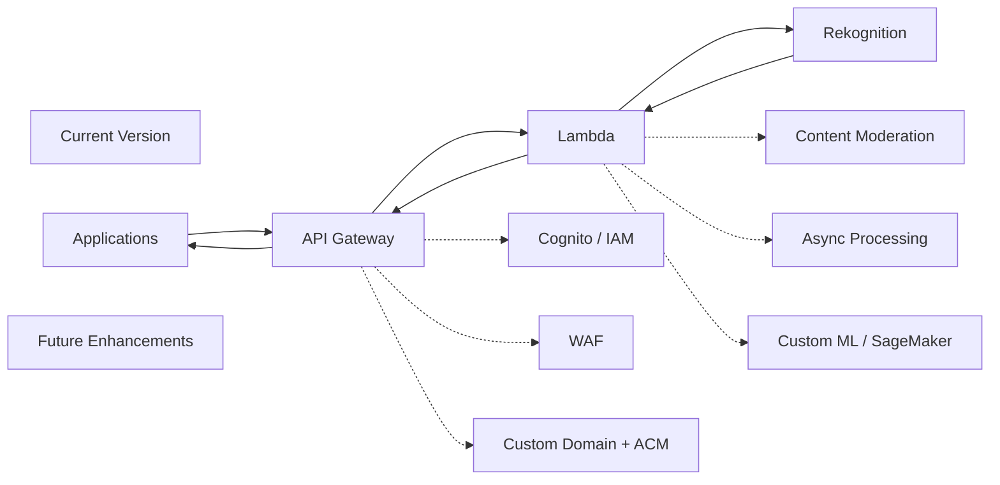

---

## 17. Future Work

The following enhancements are intentionally outside the initial implementation:

### Authentication and Authorization

Add Cognito, IAM authorization, or a private API depending on the consuming application's environment.

### AWS WAF

Protect the public API from unwanted or abusive traffic.

### Custom Domain

Expose the API through a human-friendly custom domain using API Gateway custom domains and ACM.

### Image Moderation

Use Amazon Rekognition `DetectModerationLabels` to detect inappropriate content before accepting a photo as a professional profile image.

### Asynchronous Processing

Move from synchronous analysis to an asynchronous workflow if the number of image-analysis steps grows.

### Custom ML

Use Amazon SageMaker when the required classification cannot be provided adequately by managed Rekognition capabilities.

### Emotion-Based Rules

Extend the current business rules to consider detected emotions if business requirements justify it.