# Image Analyzer

## 1. Overview

The Image Analyzer is a serverless AWS application that evaluates whether a photo is suitable for use as a professional profile picture.

The application uses Amazon Rekognition to analyze facial attributes and determine whether the submitted image meets the defined profile-photo criteria.

The solution is designed as an API rather than a user-facing website. Existing applications can submit images through an HTTPS API and receive a structured analysis result.

The application does not persist uploaded images or other personal image data.

---

## 2. Business Goal

A marketing company receives customer information and photos and uses them to create social media profiles.

The company wants to automatically identify unsuitable profile photos before they are used.

For the initial implementation, a professional-looking profile photo is defined as a photo that:

- Contains exactly one face.
- Shows the person smiling.
- Shows the person's eyes open.

---

## 3. Functional Requirements

### FR-01 — Analyze Profile Photos

The system shall analyze a submitted image and determine whether it satisfies the profile-photo criteria.

**Implementation capability:** ML-based image and facial analysis.

**AWS service:** Amazon Rekognition.

---

### FR-02 — Detect a Single Face

The system shall reject a photo if it contains zero faces or more than one face.

**Implementation capability:** Facial detection.

**AWS service:** Amazon Rekognition `DetectFaces`.

---

### FR-03 — Detect Smile

The system shall determine whether the detected person is smiling.

**Implementation capability:** Facial attribute analysis.

**AWS service:** Amazon Rekognition `DetectFaces`.

---

### FR-04 — Detect Open Eyes

The system shall determine whether the detected person's eyes are open.

**Implementation capability:** Facial attribute analysis.

**AWS service:** Amazon Rekognition `DetectFaces`.

---

### FR-05 — Integrate With Existing Applications

The system shall expose an HTTPS API that can be consumed by existing applications.

**Implementation capability:** API endpoint with Lambda integration.

**AWS services:** Amazon API Gateway and AWS Lambda.

---

### FR-06 — Support Image Formats

The system shall support:

- `.jpeg`
- `.png`

The application shall validate the submitted image before sending it for analysis.

**Implementation capability:** Request validation and image processing.

**AWS service:** AWS Lambda.

---

### FR-07 — Return a Structured Result

The system shall return a response that allows consuming applications to determine whether the photo is suitable.

The response shall include the analysis result and, where applicable, a reason for rejection.

---

## 4. Non-Functional Requirements

### NFR-01 — High Availability

The application shall use highly available managed AWS services without requiring users to manage application servers.

**AWS services:** API Gateway, Lambda, and Amazon Rekognition.

---

### NFR-02 — Low Cost

The solution shall use serverless and pay-per-request services to avoid infrastructure costs when the application is idle.

**AWS services:** API Gateway, Lambda, and Amazon Rekognition.

---

### NFR-03 — Scalability

The application shall support workloads of up to approximately 20 requests per second.

The architecture shall rely on managed services capable of scaling without manually provisioning application servers.

**AWS services:** API Gateway, Lambda, and Amazon Rekognition.

---

### NFR-04 — Low Operational Overhead

The application shall minimize infrastructure management by using managed AWS services.

---

## 5. Data Requirements

### DR-01 — Do Not Persist Personal Images

The system shall not permanently store submitted images.

Images may exist temporarily in application memory while being processed, but the solution shall not persist them to S3, databases, or other storage services.

---

### DR-02 — Minimize Personal Data Exposure

The application shall process only the information required to determine whether the image meets the profile-photo criteria.

---

## 6. Technical Requirements

### TR-01 — Infrastructure as Code

All infrastructure created for the project shall be provisioned using Terraform.

---

### TR-02 — Python Application Logic

The image-analysis application logic shall be implemented using Python.

---

### TR-03 — ML-Based Classification

The classification logic shall use an AWS managed ML service rather than manually implemented image-recognition algorithms.

**AWS service:** Amazon Rekognition.

---

### TR-04 — Application Integration

The API shall support integration with Python applications and other HTTP clients.

---

### TR-05 — HTTPS API

The application shall expose its functionality through an HTTPS endpoint.

**AWS service:** Amazon API Gateway.

---

## 7. Security Requirements

### SEC-01 — No AWS Credentials in Client Applications

Consuming applications shall not require AWS credentials to call Amazon Rekognition directly.

The client communicates with API Gateway instead.

---

### SEC-02 — Least Privilege

The Lambda execution role shall have only the permissions required to:

- Invoke Amazon Rekognition facial analysis.
- Write Lambda logs to CloudWatch Logs.

---

### SEC-03 — No Image Storage

The architecture shall not introduce persistent image storage.

---

### SEC-04 — Encrypted Communication

Client communication with the API shall use HTTPS.

---

## 8. Requirement-to-Capability Mapping

```mermaid
flowchart TD
    FR1[FR-01 Analyze Profile Photos] --> CAP1[ML Image Analysis]
    FR2[FR-02 Detect Single Face] --> CAP2[Facial Detection]
    FR3[FR-03 Detect Smile] --> CAP3[Facial Attribute Analysis]
    FR4[FR-04 Detect Open Eyes] --> CAP3
    FR5[FR-05 Application Integration] --> CAP4[HTTPS API]
    FR6[FR-06 Image Format Support] --> CAP5[Request and Image Validation]
    FR7[FR-07 Structured Result] --> CAP6[Response Processing]

    NFR1[NFR-01 High Availability] --> CAP7[Managed Serverless Services]
    NFR2[NFR-02 Low Cost] --> CAP8[Pay-per-Request Architecture]
    NFR3[NFR-03 Scalability] --> CAP9[Managed Horizontal Scaling]
    NFR4[NFR-04 Low Operational Overhead] --> CAP7

    DR1[DR-01 No Image Persistence] --> CAP10[In-Memory Processing]
    DR2[DR-02 Minimize Data Exposure] --> CAP10

    TR1[TR-01 Infrastructure as Code] --> CAP11[Terraform]
    TR2[TR-02 Python Logic] --> CAP12[Python Lambda]
    TR3[TR-03 ML Classification] --> CAP1
    TR4[TR-04 Application Integration] --> CAP4
    TR5[TR-05 HTTPS API] --> CAP4
```

---

## 9. Capability-to-AWS-Service Mapping

| Capability | AWS Service |
|---|---|
| HTTPS API | Amazon API Gateway |
| Request routing | Amazon API Gateway |
| Application logic | AWS Lambda |
| Image validation | AWS Lambda |
| Facial detection | Amazon Rekognition |
| Smile detection | Amazon Rekognition |
| Eyes-open detection | Amazon Rekognition |
| API-to-Lambda integration | Amazon API Gateway + AWS Lambda |
| ML analysis | Amazon Rekognition |
| Application logging | Amazon CloudWatch Logs |
| Infrastructure as Code | Terraform |
| Persistent image storage | Not used |

---

## 10. Requirement-to-Service Summary

| Requirement | AWS Service / Design Decision |
|---|---|
| Analyze images | Amazon Rekognition |
| Detect exactly one face | Amazon Rekognition |
| Detect smile | Amazon Rekognition |
| Detect open eyes | Amazon Rekognition |
| Integrate with applications | API Gateway |
| Execute business logic | Lambda |
| Support PNG/JPEG | Lambda + Rekognition |
| High availability | Managed serverless services |
| Low cost | Pay-per-request services |
| Scalability | API Gateway + Lambda + Rekognition |
| No image persistence | No storage service |
| Logging | CloudWatch Logs |
| Infrastructure as Code | Terraform |

---

## 11. Out of Scope for the Initial Version

The following capabilities are intentionally excluded from the initial implementation:

- User authentication and authorization.
- API Gateway custom domains.
- AWS WAF.
- Custom ML model training.
- Amazon SageMaker model hosting.
- Persistent image storage.
- Asynchronous image processing.
- Image moderation.
- Advanced emotion-based business rules.

These capabilities may be considered as future enhancements.