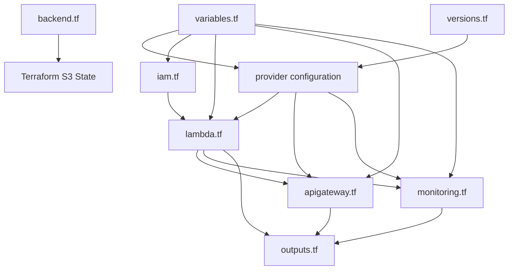
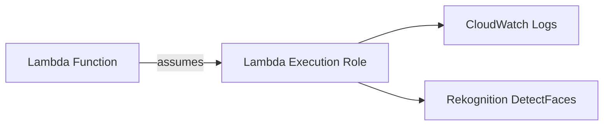
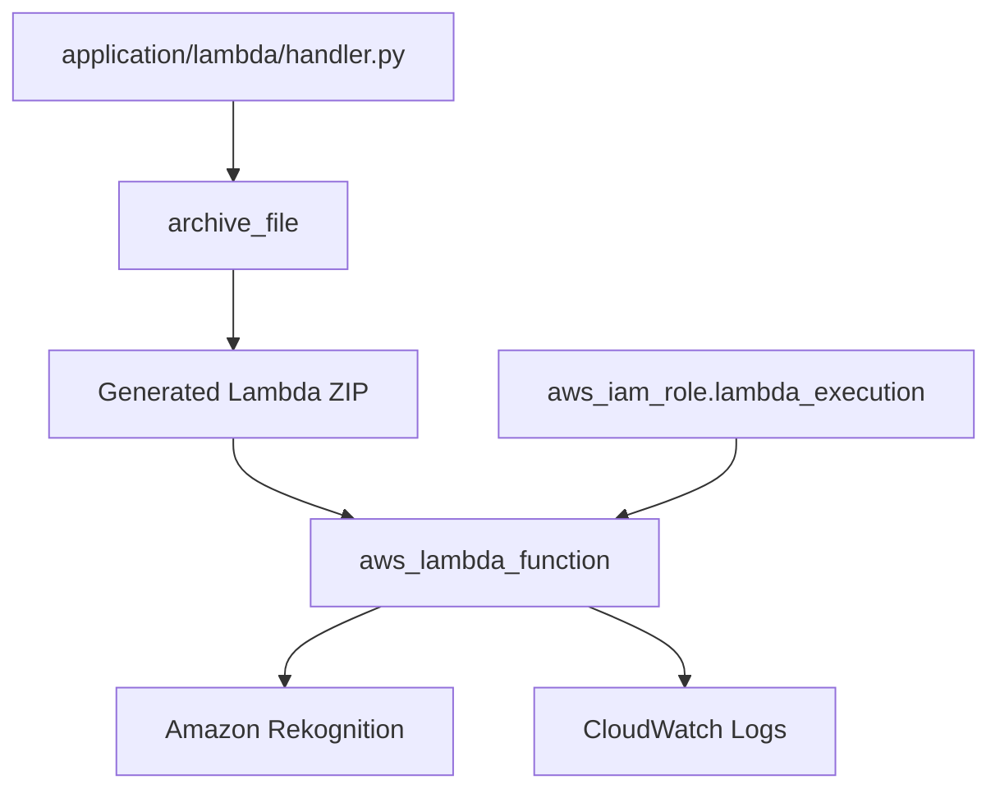
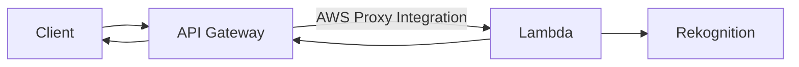
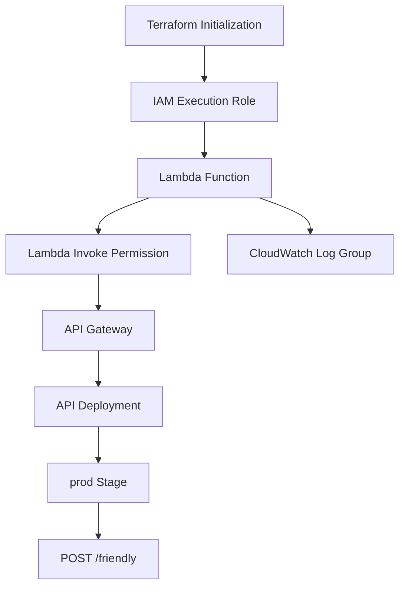
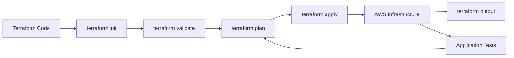

# Terraform Infrastructure

This directory contains the Terraform configuration for the **Image Analyzer** project.

Terraform provisions the AWS infrastructure required to expose an image-analysis API backed by AWS Lambda and Amazon Rekognition.

## Architecture



## Terraform Files

```text
terraform/
├── README.md
├── backend.tf
├── versions.tf
├── variables.tf
├── iam.tf
├── lambda.tf
├── apigateway.tf
├── monitoring.tf
└── outputs.tf
```

## File Responsibilities

### `backend.tf`

Defines the Terraform backend configuration.

```hcl
terraform {
  backend "s3" {
    use_lockfile = true
  }
}
```

The backend configuration is completed during initialization using:

```bash
terraform init \
  -backend-config="bucket=aliaa-image-analyzer-tfstate" \
  -backend-config="key=projects/image-analyzer/terraform.tfstate" \
  -backend-config="region=us-east-1"
```

The S3 bucket stores the Terraform state remotely.

Terraform state is not stored in the Git repository.

---

### `versions.tf`

Defines:

- Terraform version requirement
- AWS provider
- Archive provider
- AWS region configuration

The AWS provider is used to provision AWS resources.

The Archive provider packages the Lambda source code into a ZIP file.

---

### `variables.tf`

Defines reusable project configuration:

```text
aws_region
project_name
```

Current defaults:

```text
aws_region   = us-east-1
project_name = image-analyzer
```

Keeping these values in variables avoids hardcoding project configuration throughout the Terraform files.

---

### `iam.tf`

Creates the Lambda execution role.



The role contains:

- Lambda trust relationship
- CloudWatch Logs permissions
- `rekognition:DetectFaces`

The Rekognition permission follows the least-privilege approach for the functionality required by this project.

---

### `lambda.tf`

Creates the Lambda function.

The file also uses the `archive_file` data source to package:

```text
application/lambda/handler.py
```

into a generated ZIP archive.



The generated ZIP file is a build artifact and is ignored by Git.

The Lambda configuration currently uses:

```text
Runtime: Python 3.13
Handler: handler.lambda_handler
Memory: 256 MB
Timeout: 30 seconds
Architecture: x86_64
```

---

### `apigateway.tf`

Creates the REST API and connects it to Lambda.

The API exposes:

```text
POST /prod/friendly
```

Integration type:

```text
AWS_PROXY
```

The relationship is:



The Lambda permission resource explicitly allows API Gateway to invoke the function.

The API currently uses:

```text
authorization = NONE
```

This is intentional for the MVP implementation.

Authentication and authorization can be added later.

---

### `monitoring.tf`

Manages the Lambda CloudWatch Log Group:

```text
/aws/lambda/image-analyzer-function
```

Terraform configures:

```text
Retention: 14 days
```

The Log Group may already exist because AWS Lambda automatically creates it when the function is invoked.

If that happens before Terraform manages the resource, import it:

```bash
terraform -chdir=terraform import \
  aws_cloudwatch_log_group.lambda \
  "/aws/lambda/image-analyzer-function"
```

After importing, Terraform manages the resource normally.

---

### `outputs.tf`

Exposes useful values after deployment:

```text
lambda_function_name
api_gateway_id
api_gateway_invoke_url
friendly_endpoint
```

For example:

```bash
terraform -chdir=terraform output
```

Or:

```bash
terraform -chdir=terraform output -raw friendly_endpoint
```

The application test client uses this output instead of hardcoding the API URL.

---

## Infrastructure Dependency Flow



## Terraform State

The project uses an S3 remote backend.

```text
Bucket:
aliaa-image-analyzer-tfstate

Key:
projects/image-analyzer/terraform.tfstate

Region:
us-east-1
```

The backend bucket is configured with:

- S3 server-side encryption
- Versioning
- Public access block
- Terraform state locking through `use_lockfile`

The application does **not** use this bucket for image storage.

## Terraform Workflow



## Initialization

The project provides:

```text
../scripts/setup-terraform.sh
```

Run:

```bash
bash scripts/setup-terraform.sh
```

The script:

1. Checks Terraform.
2. Checks AWS CLI.
3. Verifies AWS credentials.
4. Creates the Terraform state bucket if required.
5. Configures S3 security settings.
6. Initializes the Terraform backend.
7. Runs formatting.
8. Validates the Terraform configuration.

## Manual Terraform Commands

### Initialize

```bash
terraform -chdir=terraform init \
  -backend-config="bucket=aliaa-image-analyzer-tfstate" \
  -backend-config="key=projects/image-analyzer/terraform.tfstate" \
  -backend-config="region=us-east-1"
```

### Format

```bash
terraform -chdir=terraform fmt -recursive
```

### Validate

```bash
terraform -chdir=terraform validate
```

### Plan

```bash
terraform -chdir=terraform plan
```

### Save a plan

```bash
terraform -chdir=terraform plan \
  -out=image-analyzer.tfplan
```

### Apply a saved plan

```bash
terraform -chdir=terraform apply \
  "image-analyzer.tfplan"
```

### Show outputs

```bash
terraform -chdir=terraform output
```

### Get the API endpoint

```bash
terraform -chdir=terraform output -raw friendly_endpoint
```

### Import an existing CloudWatch Log Group

If Lambda created the Log Group automatically:

```bash
terraform -chdir=terraform import \
  aws_cloudwatch_log_group.lambda \
  "/aws/lambda/image-analyzer-function"
```

Then verify:

```bash
terraform -chdir=terraform plan
```

The expected change was:

```text
retention_in_days = 0 -> 14
```

## Deployment

The normal deployment flow is:

```bash
bash scripts/setup-terraform.sh

terraform -chdir=terraform plan \
  -out=image-analyzer.tfplan

terraform -chdir=terraform apply \
  "image-analyzer.tfplan"
```

## Destroy Infrastructure

Destroy Terraform-managed resources:

```bash
terraform -chdir=terraform destroy
```

After infrastructure destruction, the Terraform state backend can be removed separately:

```bash
bash scripts/cleanup-terraform-backend.sh
```

The cleanup script requires explicit confirmation by typing:

```text
DELETE
```

## Generated Files

The following files are generated locally and should not be committed:

```text
.terraform/
*.tfstate
*.tfstate.*
*.tfplan
*.tfplan.json
*.zip
```

The Lambda ZIP is generated automatically by Terraform.

## Important Terraform Principle

The infrastructure should be created in dependency order, but Terraform determines the actual dependency graph from resource references.

For this project:

```text
IAM
 ↓
Lambda
 ↓
API Gateway
 ↓
Deployment
 ↓
Stage
```

CloudWatch logging is associated with Lambda independently:

```text
Lambda
 ↓
CloudWatch Log Group
```

The Terraform configuration therefore describes the desired infrastructure rather than requiring manual AWS console configuration.