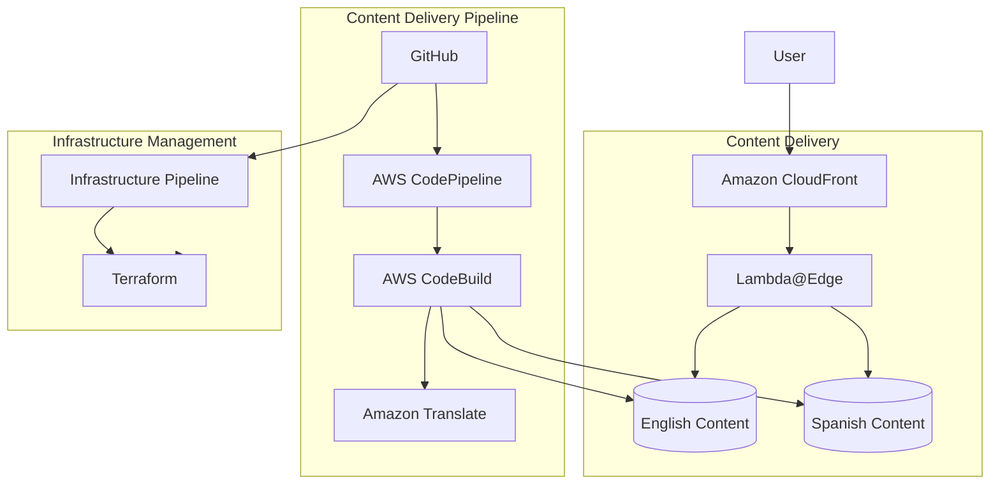
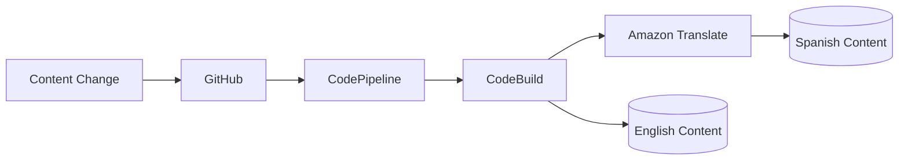
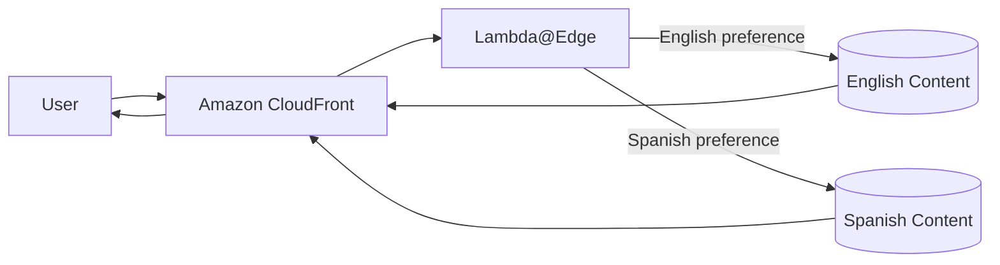
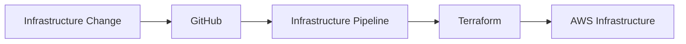

# Content Translation Pipeline — Architecture

## 1. Architecture Overview

The solution provides a language-aware static web experience for technology event content.

English content is maintained as the source of truth in GitHub.

An automated content delivery pipeline processes changes, generates translated content, and publishes the resulting language-specific content.

Amazon CloudFront provides the public delivery layer and determines which language-specific content source should serve a request based on the user's language preference.

The architecture separates infrastructure management from content delivery so that content changes can be deployed independently from infrastructure changes.

---

## 2. High-Level Architecture



---

## 3. Architecture Components

### 3.1 GitHub

GitHub is the source control system for the project.

It provides:

* Version control for source content
* Change history
* Content rollback through repository history
* The trigger point for automated content delivery
* A centralized source of truth for English content

GitHub is also used as the source repository for infrastructure changes.

### 3.2 AWS CodePipeline

AWS CodePipeline orchestrates the automated content delivery workflow.

It connects the source repository with the build and publishing stages.

Its primary responsibility is workflow orchestration rather than executing application commands.

### 3.3 AWS CodeBuild

AWS CodeBuild executes the content processing workflow.

It is responsible for running the commands required to validate, translate, and prepare content for publishing.

This keeps build and deployment logic outside the infrastructure orchestration layer.

### 3.4 Amazon Translate

Amazon Translate provides automated machine translation for supported content.

It converts the English source content into the required localized version during the content delivery process.

### 3.5 Amazon S3

Amazon S3 provides object storage for the static website content.

Each supported language has its own content location.

This separation allows the delivery layer to select the appropriate localized content independently.

### 3.6 Amazon CloudFront

Amazon CloudFront provides the public content delivery layer.

It is responsible for:

* CDN-based content delivery
* Caching
* Connecting users to the appropriate content origin
* Improving content delivery latency for the target audience

### 3.7 Lambda@Edge

Lambda@Edge provides request-time logic at the CloudFront edge layer.

Its responsibility in this architecture is to evaluate the user's language preference and allow the request to be served from the appropriate language-specific content source.

### 3.8 Terraform

Terraform manages the AWS infrastructure as code.

It provides a repeatable and version-controlled method for creating and modifying the infrastructure required by the solution.

---

## 4. Service Mapping

| Requirement / Responsibility | AWS Service       | Why It Is Used                                                       |
| ---------------------------- | ----------------- | -------------------------------------------------------------------- |
| Source control               | GitHub            | Maintains the source of truth and complete content history           |
| Pipeline orchestration       | AWS CodePipeline  | Coordinates the automated content delivery workflow                  |
| Build and processing         | AWS CodeBuild     | Executes validation, translation, and publishing commands            |
| Machine translation          | Amazon Translate  | Automates generation of localized content                            |
| Static content storage       | Amazon S3         | Provides durable, scalable storage for website assets                |
| Global content delivery      | Amazon CloudFront | Provides CDN-based delivery and caching                              |
| Language-aware routing       | Lambda@Edge       | Applies request-time language routing at the edge                    |
| Infrastructure as Code       | Terraform         | Provides repeatable and version-controlled infrastructure management |

---

## 5. Content Delivery Flow

The content delivery workflow starts when a change is committed to the source repository.



The English content remains the source of truth.

The translated content is generated from that source during the automated delivery process.

---

## 6. User Request Flow

The user request follows a separate runtime path from the content publishing workflow.



The publishing pipeline is therefore independent from the request-time delivery path.

---

## 7. Infrastructure Management Flow

Infrastructure changes follow a separate lifecycle from content changes.



This separation allows infrastructure and content changes to be managed independently.

---

## 8. Deployment Architecture

The solution uses two logical delivery paths.

### Content Delivery

```text
GitHub
   ↓
CodePipeline
   ↓
CodeBuild
   ↓
Translation + Content Publishing
   ↓
Language-specific Content Storage
   ↓
CloudFront
```

### Infrastructure Delivery

```text
GitHub
   ↓
Infrastructure Pipeline
   ↓
Terraform
   ↓
AWS Infrastructure
```

The two paths have different responsibilities and can therefore evolve independently.

---

## 9. Caching and Content Freshness

CloudFront provides caching to reduce repeated requests to the content origins.

During development and initial validation, the solution uses a short cache lifetime so that content changes can be observed quickly.

The content delivery workflow also supports explicit CDN invalidation after a successful content deployment.

This separates two concerns:

* Cache lifetime controls normal cache behavior.
* Invalidation provides an explicit mechanism for making a published change available through the CDN.

The exact cache policies and invalidation configuration belong to the implementation phase rather than the architecture definition.

---

## 10. Security Architecture

The architecture follows a private-origin model.

Users access the content through CloudFront rather than directly accessing the underlying S3 content stores.

The solution should apply:

* Controlled access between CloudFront and S3
* Least-privilege IAM permissions
* Separation of infrastructure and content permissions
* Environment isolation
* Secure handling of deployment credentials and configuration

Specific IAM policies and resource permissions are implementation details and are intentionally excluded from this architecture document.

---

## 11. Design Decisions

### 11.1 CloudFront

CloudFront is used as the public delivery layer because the application consists primarily of static content and requires low-latency delivery for users distributed across a geographic region.

### 11.2 S3

S3 is used as the content storage layer because the website consists of static assets and does not require continuously running application servers for content delivery.

### 11.3 Lambda@Edge

Lambda@Edge is used to apply language-aware request routing close to the user.

This keeps the language selection logic within the content delivery layer.

### 11.4 Amazon Translate

Amazon Translate is used to automate the generation of localized content and reduce the manual work required for maintaining multiple language versions.

### 11.5 CodePipeline and CodeBuild

CodePipeline is used to orchestrate the delivery workflow, while CodeBuild executes the actual content processing and publishing operations.

Separating orchestration from execution keeps responsibilities clear within the pipeline.

### 11.6 Separate Infrastructure and Content Pipelines

Infrastructure and content changes are managed through separate logical pipelines.

This reduces the scope of individual changes and allows content delivery to evolve without requiring infrastructure changes.

### 11.7 GitHub as the Source of Truth

GitHub remains the authoritative source for English content because it provides version history, collaboration, and a reliable mechanism for recovering previous versions.

---

## 12. Architecture Boundaries

This architecture document describes the logical architecture and responsibilities of the major components.

The following implementation details are intentionally documented separately:

* Terraform resource definitions
* Bucket names
* IAM policies
* Pipeline configuration
* Build commands
* Translation command arguments
* CloudFront cache policy configuration
* Lambda@Edge implementation
* Environment-specific values
* Deployment scripts

These details belong to the implementation stage and should not be duplicated in the architecture definition.

---

## 13. Future Extensions

The architecture can be extended to support:

* Additional languages
* Custom domains
* TLS certificates
* Infrastructure CI/CD
* More advanced content validation
* Canary content deployments
* Expanded observability
* Additional content types

These extensions are outside the initial implementation scope.