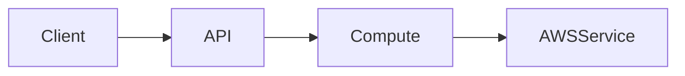

# AWS Cloud Projects

A collection of hands-on AWS cloud projects built while studying the **AWS Cloud Projects** course by Packt on Coursera.

This repository is where I turn the concepts and projects I learn into actual AWS implementations instead of only following the course material.

## Why This Repository?

I am studying AWS through a course focused on practical cloud projects.

Instead of only watching the projects being built, I want to actually build them myself in AWS.

> **If I am learning AWS through practical projects, why only watch them when I can actually build them?**

For each project, I will rebuild the solution, understand the requirements, design the architecture, implement the infrastructure, test the application, and document the final result.

The goal is not simply to complete the course projects. It is to understand:

- Why the architecture was chosen
- How the AWS services interact
- How the infrastructure is provisioned
- How the application is deployed and tested
- How security and scalability are handled
- How cloud costs can be considered
- How the solution can be maintained and improved

This repository therefore serves as both a **practical AWS learning record** and a **portfolio of implemented cloud projects**.

## Course

This repository is based on:

**AWS Cloud Projects — Packt**

Course: [https://coursera.org/learn/packt-aws-cloud-projects](https://coursera.org/learn/packt-aws-cloud-projects)

The course provides the project scenarios and learning material. The implementations in this repository are rebuilt as a hands-on learning exercise.

## Projects

Each course project will have its own directory and will be developed independently.

```text
aws-cloud-projects/
│
├── README.md
│
├── project-01/
│   ├── README.md
│   ├── docs/
│   ├── terraform/
│   ├── cloudformation/
│   └── application/
│
├── project-02/
│   ├── README.md
│   ├── docs/
│   ├── terraform/
│   ├── cloudformation/
│   └── application/
│
└── ...
```

The exact structure may differ between projects depending on their requirements and architecture.

## Project Documentation

Each project will document the solution from requirements to implementation.

Typical documentation includes:

- Problem statement
- Functional requirements
- Non-functional requirements
- Architecture
- AWS services
- Infrastructure as Code
- Application components
- Integration
- Testing
- Security considerations
- Scalability and availability
- Cost considerations
- Cleanup
- Lessons learned

## Architecture

Architecture will be documented using diagrams and technical documentation.

Where appropriate, diagrams will be created using **Mermaid** so that the architecture remains version-controlled and easy to update alongside the implementation.

Example:



The architecture documentation should always reflect the actual implementation.

If the infrastructure changes and the documentation becomes outdated, the documentation will be updated accordingly.

## Infrastructure as Code

Infrastructure will be provisioned using Infrastructure as Code whenever applicable.

The repository may use:

- Terraform
- AWS CloudFormation

Terraform and CloudFormation implementations will be kept organized within each project rather than mixing infrastructure between projects.

## Development Workflow

Each project follows a structured workflow:

```text
Requirements
     ↓
Architecture
     ↓
Documentation
     ↓
Infrastructure
     ↓
Application
     ↓
Integration
     ↓
Testing
     ↓
Security & Cost Review
     ↓
Documentation Sync
     ↓
Cleanup
```

The project is developed incrementally, with each logical change committed separately.

## Git Commit Convention

Commits follow this format:

```text
type(scope): short imperative description
```

### Commit Types

- `feat` — add a new capability
- `fix` — fix an issue
- `refactor` — restructure without changing behavior
- `docs` — documentation changes
- `chore` — maintenance or non-functional changes
- `test` — add or modify tests
- `security` — intentionally strengthen the security posture

### Commit Scopes

Scopes are based on the AWS component or project module being changed.

Examples include:

```text
terraform
iam
cloudfront
compute
ci
s3-web
security-groups
waf
ssm-parameters
alb
networking
monitoring
elasticache
rds
ecr
vpc-endpoints
```

Examples:

```text
feat(terraform): add Lambda infrastructure

feat(iam): add Rekognition permissions

feat(compute): configure Lambda function

test(compute): validate image analysis

docs(architecture): add serverless architecture diagram

security(waf): restrict malicious API requests
```

The rule is:

> **One logical change per commit.**

The `security` type is used when the primary purpose of a commit is to strengthen the security posture rather than fix a functional bug.

Documentation is kept synchronized with the implementation. When infrastructure changes and the README or architecture documentation needs to be updated, a dedicated `docs:` commit is used.

## Learning Approach

For every project, I aim to understand the implementation rather than blindly reproduce the course steps.

This includes asking:

- Why is this AWS service being used?
- What problem does it solve?
- Why was this architecture chosen?
- What are the alternatives?
- What happens when the application scales?
- How is the solution secured?
- What happens when a component fails?
- What are the expected costs?
- How could the architecture be improved?

## Goals

Through these projects, I aim to build practical experience with:

- AWS cloud architecture
- Infrastructure as Code
- Serverless architectures
- Compute services
- Networking
- Storage
- Databases
- Security
- Monitoring
- CI/CD
- AI and machine learning integrations
- Data processing and analytics
- Scalability and availability
- Cloud cost considerations

## Status

This repository is actively being developed.

Projects will be added and implemented one at a time as I progress through the course.

---

**Learn → Build → Test → Document → Improve**
